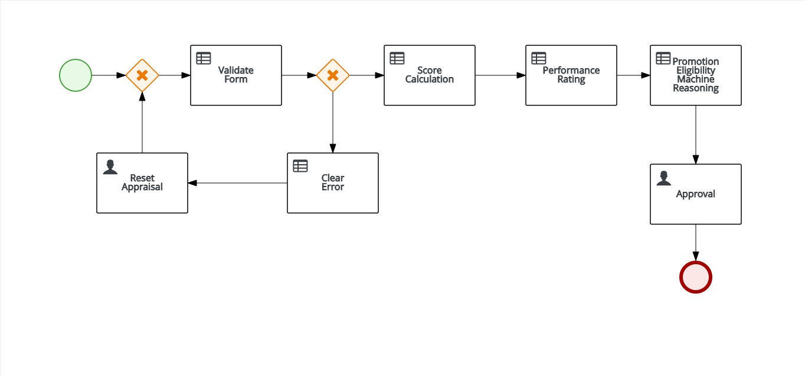
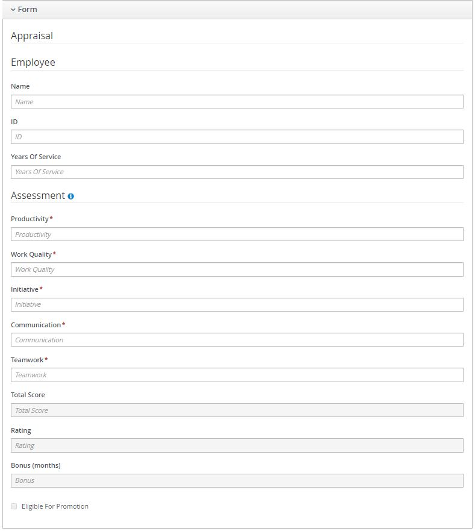
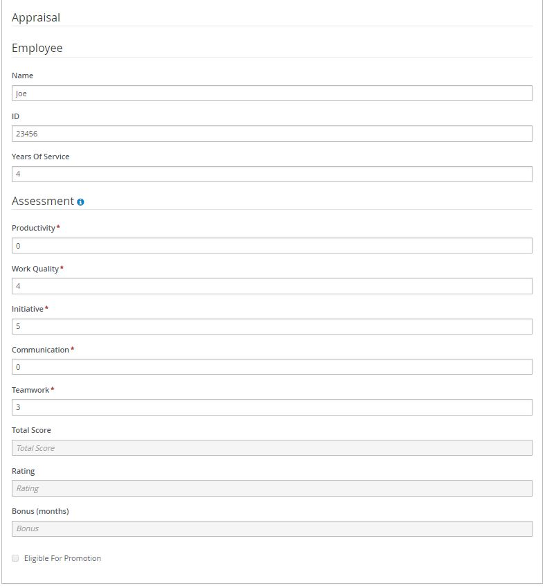

# Performance Appraisal System

**This is an individual project submission to fulfil the requirement of Machine Reasoning course.** 

The project code is zipped under I[RS-MR-2019-01-19-IS1PT-IND-NgCheongHong-Appraisal_System.zip](https://github.com/chdev7/employee-appraisal-system/blob/master/IRS-MR-2019-01-19-IS1PT-IND-NgCheongHong-Appraisal_System.zip "RS-MR-2019-01-19-IS1PT-IND-NgCheongHong-Appraisal_System.zip")

Download [JBPM ](http://https://download.jboss.org/jbpm/release/7.12.0.Final/jbpm-server-7.12.0.Final-dist.zip "JBPM ") and import the project after unzipping. 

##  EXECUTIVE SUMMARY

Managing and reviewing employee's performance is no easy task especially in multinational corporations with large workforce. Performance appraisal is often conducted during year end to review the employee's performance. 

Employee's performance is typically accessed in several appraisal criteria and then given a numeric score for each criterion. The total score can then lead to a grade or rating to determine the overall performance. The annual bonus package or reward is also tied to the performance grade most of the time. 

In the project, an appraisal system is designed to collect the appraisal score for five different criteria and a final grade will be awarded based on establised rules. The variable bonus is then calculated depending on the grade itself.  

Another feature of this system is the recommendation for promotion for employee with exceptional performance. With the length of service and performance grade given, the system is able to recommend the employee to be considered for promotion. The final outcome is then evaluated by HR or the manager. 

### Business Process Design 

In this system, the appraiser is required to fill the appraisal form with the appraisee's information and the score for respective criterion.  Then, the system will validate the input and reject the form if the input violates the validation rule. A human intervention would be needed to rectify the input in order to allow the form to be further processed. 

Once the validation is successful, the system will tabulate the aggregrate score and output the final grade and bonus when the score matches the condition defined in a guided decision table. If the appraisee's performance together with the length of service meet the promotion requirement, a checkbox will indicate his/her promotion eligibility.  

The final step which is the review and approve process will then be completed by HR or manager. 

### Use Case 

###### When there are fields with 0 score 

###### Error will be displayed at output and human intervention is required to rectify the input 

###### Once the validation is successful, the total score is calculated and final grade with bonus is determined. 

###### In this example, the appraisee's didn't meet the requirement for promotion hence the checkbox for "Eligible for Promotion" is not checked by system. The final step is to approve the appraisal by checking the approval checkbox. 

---

**This [Machine Reasoning (MR)](https://www.iss.nus.edu.sg/executive-education/course/detail/machine-reasoning "Machine Reasoning") course is part of the Analytics and Intelligent Systems and Graduate Certificate in [Intelligent Reasoning Systems (IRS)](https://www.iss.nus.edu.sg/stackable-certificate-programmes/intelligent-systems "Intelligent Reasoning Systems") series offered by [NUS-ISS](https://www.iss.nus.edu.sg "Institute of Systems Science, National University of Singapore").**

**Lecturer: [GU Zhan (Sam)](https://www.iss.nus.edu.sg/about-us/staff/detail/201/GU%20Zhan "GU Zhan (Sam)")**

**zhan.gu@nus.edu.sg**
